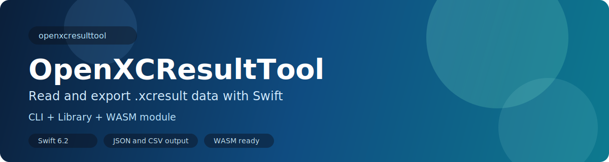
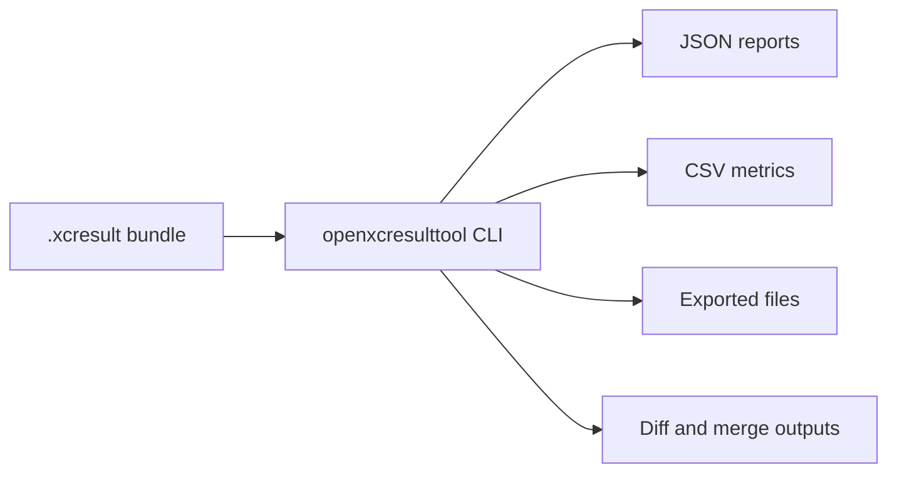

<p align="center">
  
</p>

<p align="center">
  <a href="https://github.com/alvarhansen/OpenXCResultTool/actions/workflows/static.yml">
    
  </a>
  
  
  
</p>

<p align="center">
  Read, diff, merge, and export <code>.xcresult</code> bundles with a standalone Swift CLI.
</p>

`openxcresulttool` gives you repeatable access to XCResult data without requiring Xcode CLI tooling in your pipeline.

## Why this project

- Query test summaries, test trees, test details, activities, metrics, and insights.
- Export diagnostics, attachments, metrics CSV, or raw objects.
- Compare two result bundles and merge multiple bundles.
- Run in native Swift environments and as a WASM module for browser experiments.



## Quick start

### 1. Build and verify

```bash
swift build
swift run openxcresulttool version
```

### 2. Run your first query

```bash
BUNDLE="Tests/Fixtures/Test-RandomStuff-2026.01.11_12-36-33-+0200.xcresult"
swift run openxcresulttool get test-results summary --path "$BUNDLE" --format json
```

## Command map

| Area | Commands |
| --- | --- |
| Read data | `get build-results`, `get content-availability`, `get object`, `get log` |
| Test data | `get test-results summary`, `tests`, `test-details`, `activities`, `metrics`, `insights` |
| Export | `export diagnostics`, `attachments`, `metrics`, `object` |
| Metadata | `metadata get`, `metadata addExternalLocation` |
| Structure tools | `graph`, `formatDescription get`, `formatDescription diff` |
| Result operations | `compare`, `merge`, `version` |

## Common workflows

### Summarize a run

```bash
swift run openxcresulttool get test-results summary \
  --path /path/to/MyRun.xcresult \
  --format json
```

### Inspect a single test

```bash
swift run openxcresulttool get test-results test-details \
  --path /path/to/MyRun.xcresult \
  --test-id "MyTests/testExample" \
  --format json
```

### Compare two result bundles

```bash
swift run openxcresulttool compare \
  --baseline-path /path/to/baseline.xcresult \
  /path/to/current.xcresult
```

### Merge multiple bundles

```bash
swift run openxcresulttool merge \
  --output-path /tmp/merged.xcresult \
  /path/to/a.xcresult \
  /path/to/b.xcresult
```

### Export diagnostics and attachments

```bash
swift run openxcresulttool export diagnostics \
  --path /path/to/MyRun.xcresult \
  --output-path /tmp/diagnostics

swift run openxcresulttool export attachments \
  --path /path/to/MyRun.xcresult \
  --output-path /tmp/attachments \
  --only-failures
```

## Legacy-format notes

Some commands intentionally mirror legacy `xcresulttool` output and require `--legacy`:

- `get object`
- `graph`
- `formatDescription get`
- `formatDescription diff`
- `export object`

## WASM + browser harness

The repo includes a browser harness in `web/` for calling exported WASM functions.

Live web version: [https://alvarhansen.github.io/OpenXCResultTool/](https://alvarhansen.github.io/OpenXCResultTool/)

```bash
make wasm-image
make wasm-sqlite
make wasm-module
cp .build/wasm32-unknown-wasip1/debug/openxcresulttool-wasm.wasm web/openxcresulttool.wasm
```

Then serve and open:

```bash
cd web
python3 -m http.server 8080
```

See `web/README.md` for full usage details and browser limitations.

If your clone uses Git LFS-managed binary artifacts, fetch them with:

```bash
git lfs install
git lfs pull
```

## Development

```bash
swift build
swift test
```

Optional containerized targets (from `Makefile`):

```bash
make linux-build
make linux-test
make wasm-module-min
```

## Project layout

- `Sources/OpenXCResultTool/` core parsing and export logic.
- `Sources/OpenXCResultToolCLI/` argument parsing and command wiring.
- `Sources/OpenXCResultToolWasm/` WASM entry points and exports.
- `Tests/OpenXCResultToolTests/` XCTest coverage.
- `Documentation/` reverse-engineering notes and references.
- `web/` browser harness for WASM experimentation.
